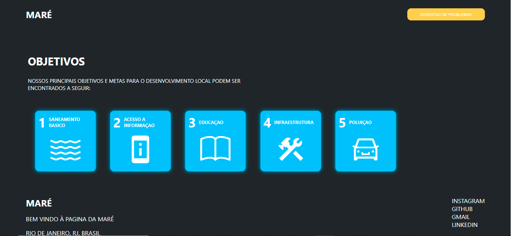

<h1 align='center'>Final project by Vai NA Web</h1>

<h4 align='center'> 
	status: in the process...  🚧

<h1 align='center'>Creating a page about some issues and ideais to reduce them</h1>

<h2>Technologies</h2>

- Reacjs
- Styled-Components
- Routers

<h1>How to use </h1>

- git clone https://github.com/diog0bjj/MareGoals.git
- cd
- npm install
- code .
- npm start

<h1> On Line Page</h1>

Click here: https://maregoals.netlify.app/

<h1 align='center'>Contacts</h1>

  

